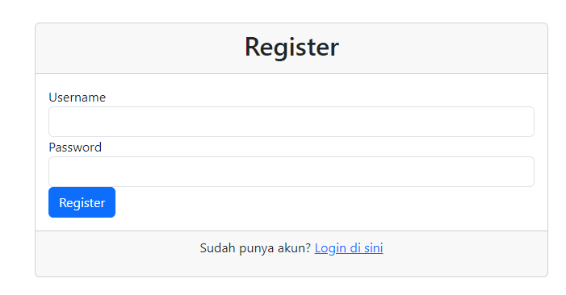
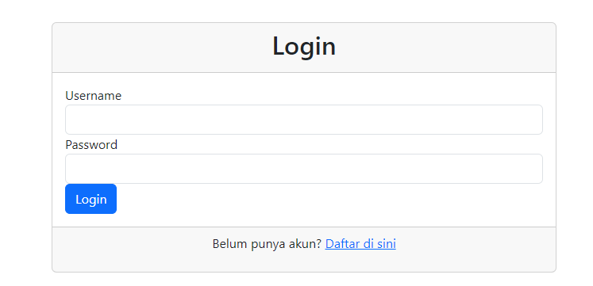
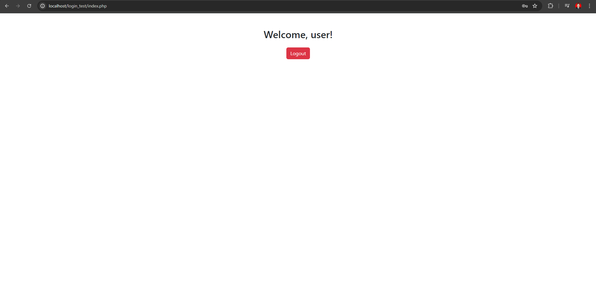

# Student Management System

## Deskripsi Proyek

Student Management System adalah aplikasi berbasis web sederhana yang memungkinkan pengguna untuk melakukan registrasi, login, dan mengelola data siswa. Aplikasi ini dibangun menggunakan PHP dan MySQL untuk backend, serta Bootstrap untuk desain antarmuka pengguna.

## Halaman Registrasi (`register.php`)

Halaman `register.php` memungkinkan pengguna baru untuk mendaftar ke sistem. Pengguna harus mengisi username dan password. Password yang dimasukkan akan di-hash sebelum disimpan di database untuk keamanan.

### Tampilan Halaman Registrasi

### Tampilan Halaman Login

### Tampilan Halaman Index

